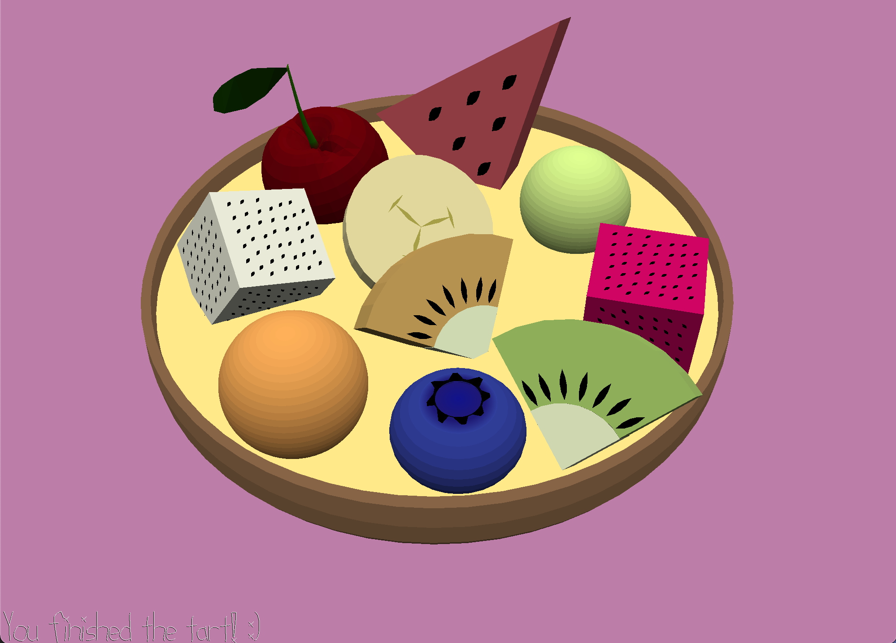

# Tart Time!

Author: Emma Liu

Design: You are an elite pastry chef from Le Cordon Blue in France! Arrange this tart full of colorful fruits to your heart's content. There is no score objective for this game, only aesthetics, which makes it perfect for perfectionists. 

Screen Shot:

How To Play:

You will need to place 10 fruits on the tart, but you can do this in any order. Prior to placing the fruit on the tart, load it into the staging area and rotate it until its orientation pleases you. Unlike real life, you can undo and redo your fruit placements to your heart's content. Once you're done, take a pic for your food insta!

To place fruits:
- SPACEBAR: Load fruit into staging zone (you can't rotate/place the piece until you do this)
- 1,2,3: Toggle between fruit's local axes
- A/D: Increment/decrement rotation around set axis
- T: Toggle to set different fruit (among others not placed on tart yet)
- U: Undo placed moves (in LIFO order)
- Mouse click: Throw the fruit into the scene. It will roughly land where your cursor selected.

To control the camera view:
- ENTER: Enter camera edit mode
- ESC: Exit camera edit mode
- LEFT/RIGHT/UP/DOWN: Move the camera
- Mouse motion: Rotate the camera

Sources: 

These assets were built by myself in Blender. I used the following tutorials as inspiration:
- [Making a cherry in blender step by step easy tutorial](https://www.youtube.com/watch?v=TwdakP4BfE4&ab_channel=GraphicalGurujii)
- [Create a blueberry in Blender in 1 Minute](https://www.youtube.com/watch?v=MlGn040MRwo&ab_channel=1minuteBlender)

This game was built with [NEST](NEST.md).

